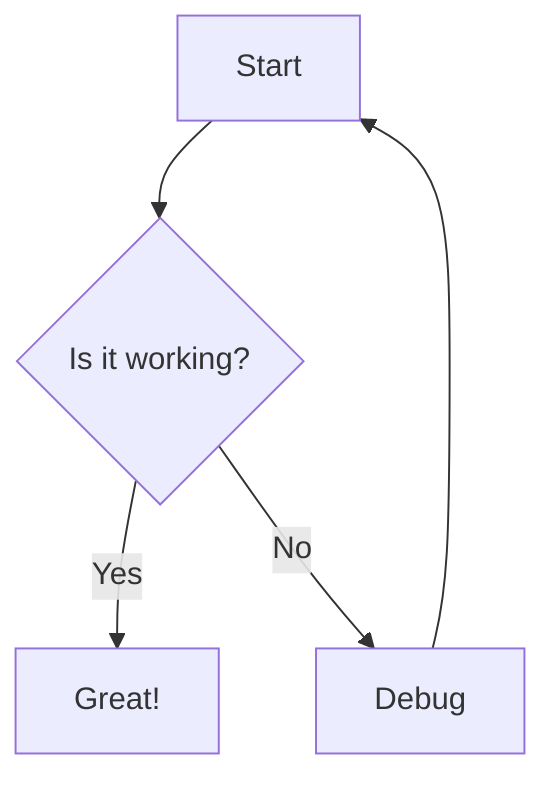
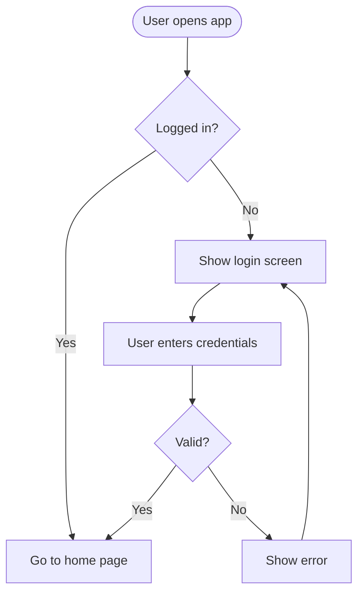
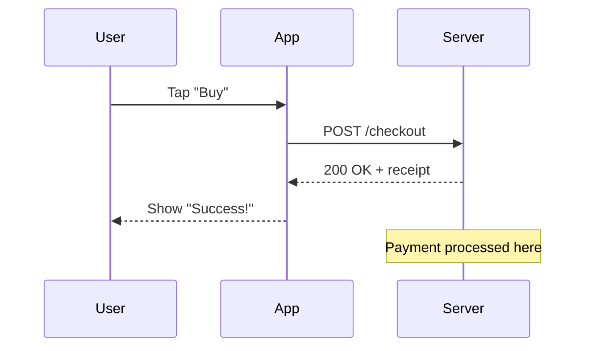
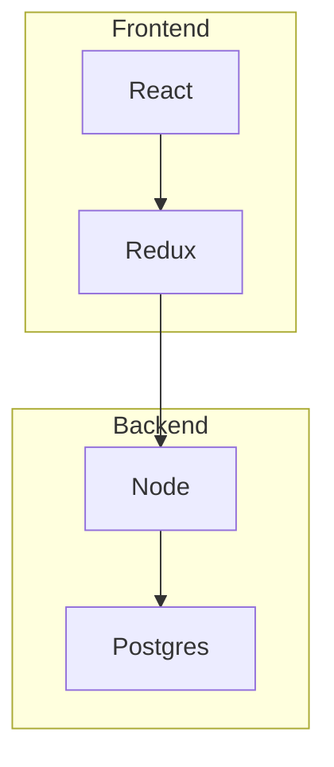

# Mermaid Charts

Mermaid charts let you make diagrams and flowcharts using just text — perfect for docs, notes, or quick visuals. You write simple code, and it renders into a diagram.

---

## 1. Basic Idea

Mermaid = markdown-style syntax for diagrams. Instead of dragging boxes in PowerPoint, you type:



That renders as a flowchart. Top Down TD, with boxes and a decision diamond.


---


## 2. Flowchart Syntax — the 80/20

Flowcharts are what 90% of people use Mermaid for. Here's the core:

### Directions

```
graph TD = Top Down
graph LR = Left to Right
graph RL = Right to Left
graph BT = Bottom to Top
```

### Shapes

```
A[Rectangle]
B(Round edges)
C{Rhombus/Diamond for decisions}
D((Circle))
E>Flag shape]
F{{Hexagon}}
```


here's the meaning of each shape in plain paragraph format, no table.

The rectangle written as `A[Rectangle]` is the standard shape for a process or action. Use it whenever something needs to be done, like "Send email", "Calculate total", or "Save to database". It's the workhorse of flowcharts and you'll use it the most.

Round edges written as `B(Round edges)` gives you a stadium or pill shape. This represents terminal points in your flow — specifically start and end. So you'd use it for "Start", "End", "Exit app", or "Return to home page". It tells the reader where the diagram begins and stops.

The rhombus or diamond written as `C{Rhombus/Diamond}` is used for decisions and branches. Any time your flow asks a question that splits the path, use a diamond. Think "Is user logged in?", "Payment successful?", or "Age > 18?". A diamond should always have two or more arrows coming out of it, usually labeled Yes/No or True/False.

A circle written as `D((Circle))` is a connector. Its job is to jump from one part of the chart to another so you don't have lines crossing all over the place. You put the same label in two circles to show they connect. Some people also use a single circle as a start/end point, but the main use is avoiding spaghetti diagrams.

The flag shape written as `E>Flag shape]` represents a document or output. Use it when your process creates something tangible like "Generate PDF", "Print invoice", "Export CSV", or "Display report". It visually signals that information is being produced for the user.

The hexagon written as `F` means preparation or setup. It's for things that need to happen before the main process starts, like "Load config file", "Initialize database", "Authenticate API key", or "Preload cache". It sets the stage for the actual work.

**Rule of thumb:** Rectangle = do stuff, Round = start/stop, Diamond = ask question, Circle = jump, Flag = output doc, Hexagon = prep work. If you only remember the first three, you'll cover 95% of diagrams.

### Arrows & Links

```
A --> B          Arrow
A --- B          Line, no arrow
A -.-> B         Dotted arrow
A ==> B          Thick arrow
A -- Text --> B  Label on arrow
A -->|Text| B    Another way to label
```

### Full Mini Example: Login Flow



---

## 4. Sequence Diagram Syntax

Shows interactions over time. Great for APIs, user\<->system.



- `->>` = solid line = request/call
- `-->>` = dashed line = response/return

---

## 6. Pro Tips

**Keep IDs short:** Use `A`, `B`, `C1` not `TheUserAccountSystem`. Display text goes in `[brackets]`

**Subgraphs:** Group things



**Styling:** `classDef green fill:#9f6,stroke:#333; class A green;`

**Click links:** `A[Google]:::clickable` then `click A "https://google.com"`
