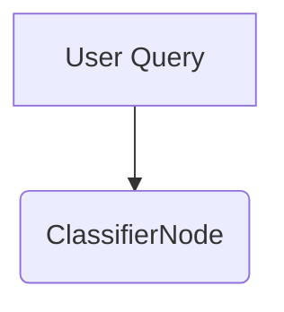
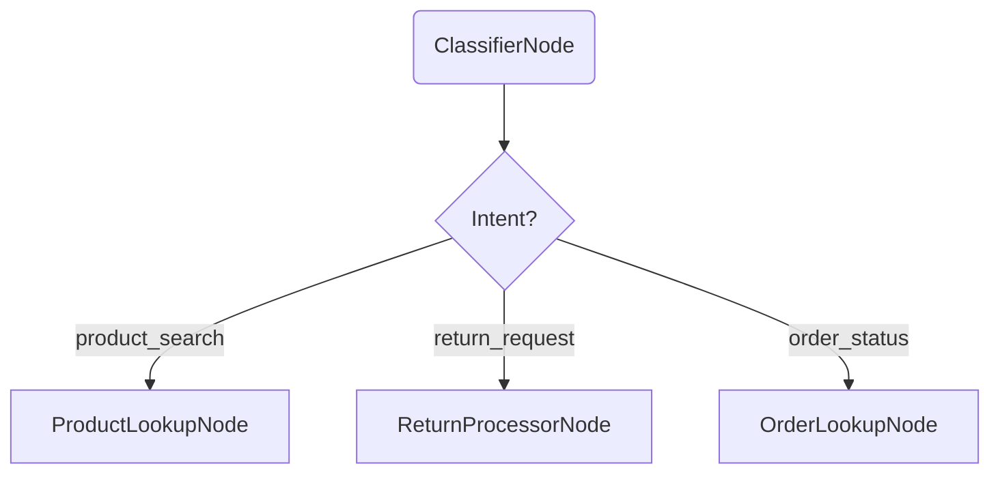
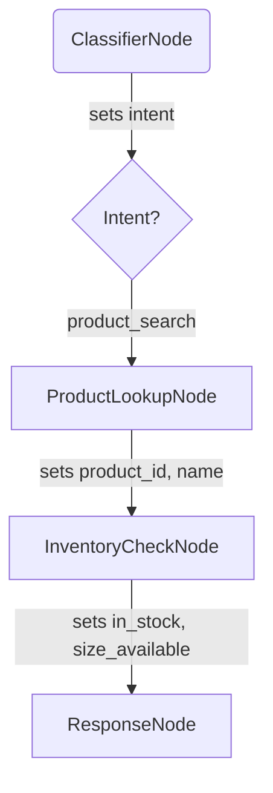
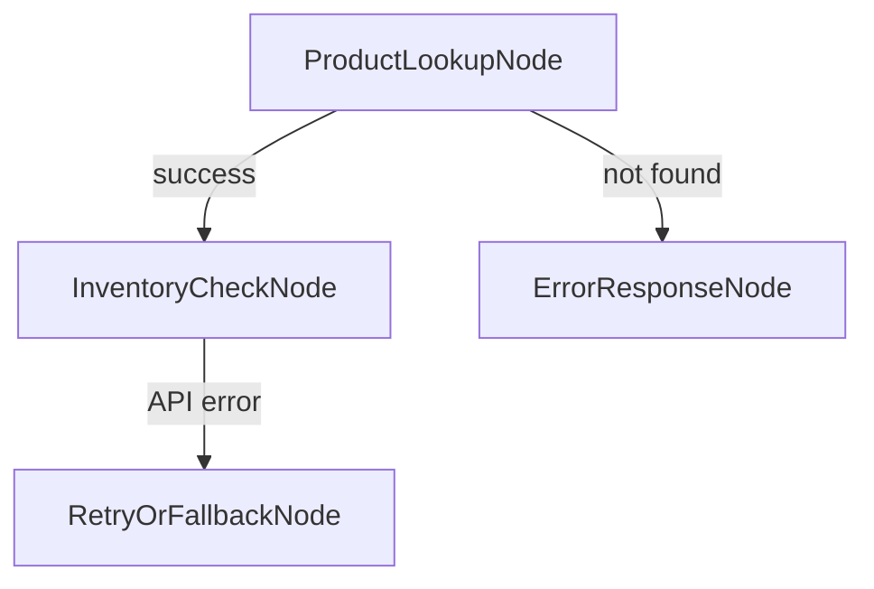
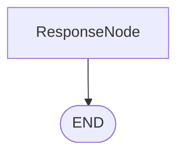
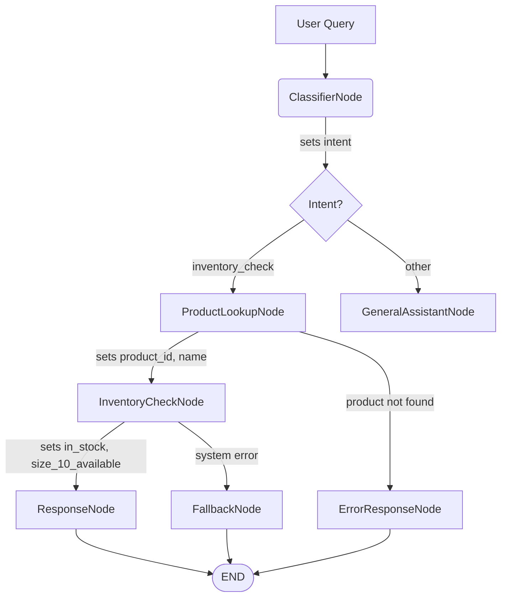

Using **Mermaid charts** to plan LangGraph workflows is a smart, visual way to design your graph **before writing code**. Here’s a practical, step-by-step guide:

---

### ✅ **Why Use Mermaid for LangGraph Planning?**
- Visualize **nodes**, **edges**, and **decision logic**
- Clarify **state flow** and **dependencies**
- Spot missing paths (e.g., error handling)
- Share design with teammates easily

---

### 🧭 Step-by-Step: How to Plan with Mermaid

#### **1. Start with User Intent → Entry Point**
Ask: *“What’s the first thing the system does?”*  
→ Usually a **Classifier** or **Intake** node.

---

#### **2. Add Nodes as Rectangles (or Rounded Rectangles)**
Each node = a **unit of work** that updates state.

> 💡 Use **diamonds `{}`** for **edge logic** (even though edges are functions, this shows routing decisions).

---

#### **3. Annotate What Each Node *Writes* to State**
Add **comments or labels** showing key state updates:

> This mirrors your **node write contract**.

---

#### **4. Include Error & Fallback Paths**
Don’t forget: real systems fail!

---

#### **5. Mark the Final Output Node**
Usually ends with a **ResponseNode** or **END**.

---

### 📋 Example: Full Mermaid Plan for Shoe Query

---

### 🔧 Pro Tips for Effective Planning

| Tip | Why It Helps |
|-----|--------------|
| **Use consistent node names** (e.g., `*Node` suffix) | Matches your code later |
| **Label edges with state conditions** (e.g., `intent == "return"`) | Clarifies edge logic |
| **Group related nodes** visually | Shows subsystems (e.g., “Returns Flow”) |
| **Keep it high-level first**, then add detail | Avoid over-engineering early |
| **Validate**: “Can I trace a user query through this?” | Catches missing paths |

---

### 🔄 From Mermaid → Code

Once your chart is solid:
1. **Each box** → a **node function** in Python
2. **Each decision diamond** → an **edge function**
3. **State fields** → define your `TypedDict` schema
4. **Arrows** → `add_conditional_edges()` or `add_edge()`

---

### 💡 Bonus: Use Mermaid Live Editor
- Go to [https://mermaid.live](https://mermaid.live)
- Sketch your graph interactively
- Export as PNG or embed in docs

---

### ✅ Summary

> **Plan your LangGraph with Mermaid by:**
> 1. Starting at the **entry node**
> 2. Drawing **nodes as state-updating steps**
> 3. Using **diamonds for routing logic**
> 4. **Labeling state changes** on edges
> 5. Including **error/fallback paths**
> 6. Ending at a **clear output/END**

This turns abstract logic into a **shared, testable blueprint** — before you write a single line of Python. 🚀